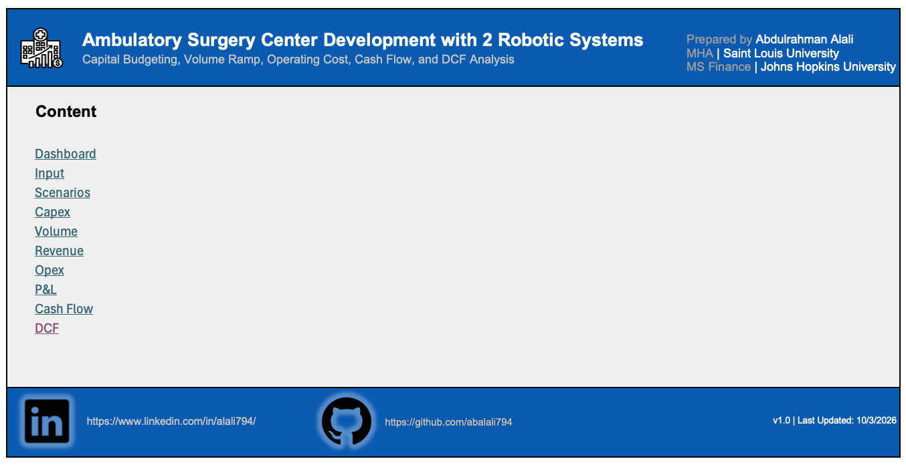
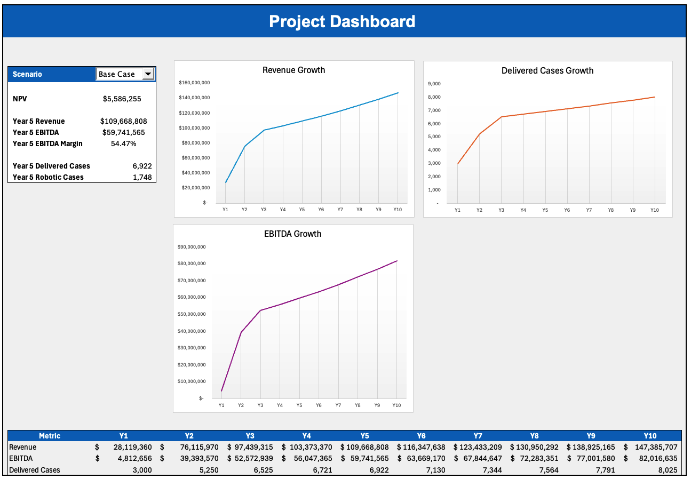
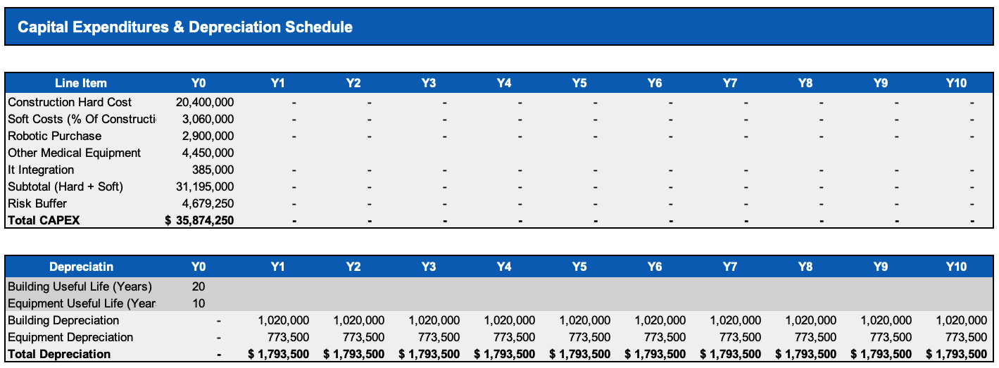
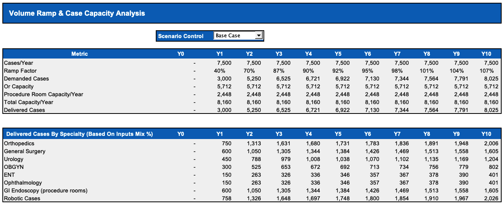
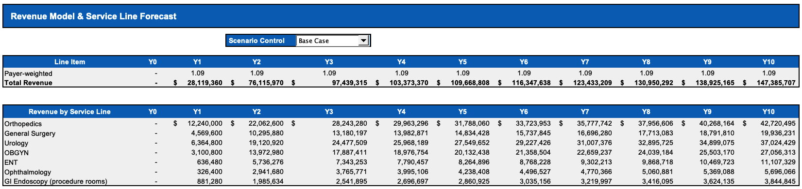
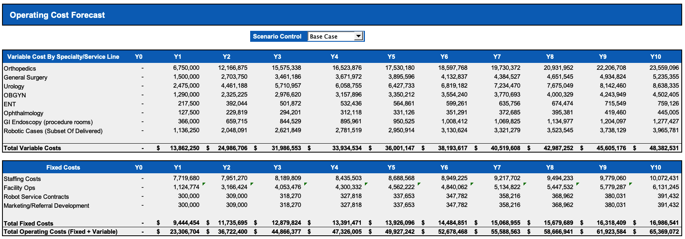
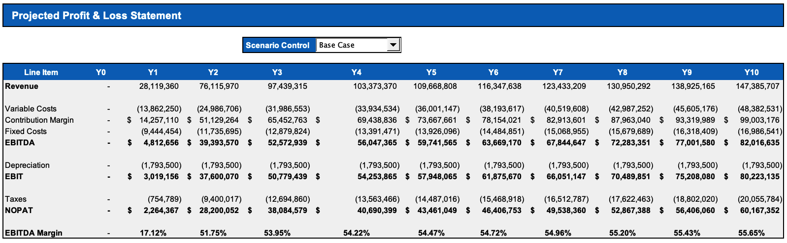
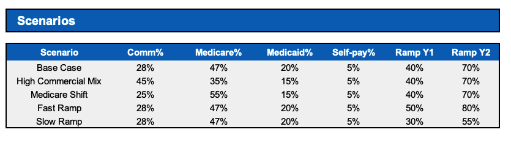
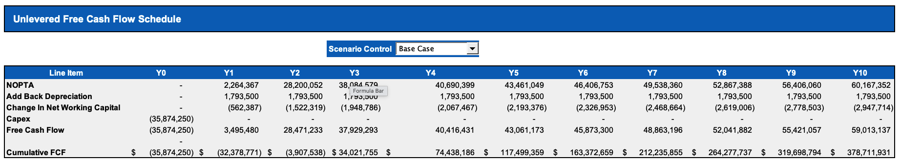
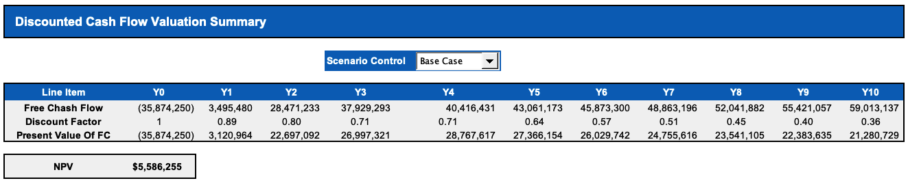

# Ambulatory Surgery Center Development with 2 Robotic Systems  
### Capital Budgeting, Volume Ramp, Operating Cost, Cash Flow, and DCF Analysis

This project is an Excel-based capital budgeting and financial modeling case for the development of a new **Ambulatory Surgery Center (ASC)** with **2 robotic systems**. The model evaluates whether the investment is financially attractive by projecting **volume ramp, revenue, operating expenses, profitability, free cash flow, and discounted cash flow valuation** over a 10-year period.

The goal of this project is to demonstrate practical healthcare finance modeling skills in a real-world provider setting, combining **capital planning, operational assumptions, reimbursement logic, scenario analysis, and valuation** in one integrated model.

---

## Project Overview

This model answers a core capital budgeting question:

**Should a health system invest in building a new ASC with robotic surgery capability?**

To answer that, the model estimates:

- Initial capital investment
- Case volume ramp-up over time
- Payer-mix-adjusted reimbursement
- Variable and fixed operating costs
- EBITDA, EBIT, and NOPAT
- Unlevered free cash flow
- FCF, DCF, and NPV

The workbook is built to show how operational assumptions flow into financial performance and investment returns.

---

## Executive Summary & Takeaways

Under the base case, the proposed ASC with 2 robotic systems appears financially supportable, generating a positive NPV of $5.6M while reaching $109.7M in Year 5 revenue and $59.7M in Year 5 EBITDA, equivalent to a 54.5% EBITDA margin. Volume ramps from 3,000 cases in Year 1 to 6,922 in Year 5 and 8,025 by Year 10, showing strong operating leverage as the center matures. **The investment case is** **attractive**, **but value is highly sensitive to early ramp execution and payer mix**: a Fast Ramp improves NPV to $11.6M, a Slow Ramp turns NPV negative at ($2.4M), a High Commercial Mix increases NPV significantly to $46.8M, and a Medicare Shift reduces NPV to $4.5M. Overall, the project merits consideration, but approval should be tied to confidence in referral capture, physician alignment, and commercial reimbursement strength, since those are the main drivers of upside and downside.

* **Three facts stand out:**

1. **Payer mix is the biggest value lever**  
   A stronger commercial mix drives a major jump in valuation, while a Medicare-heavy mix compresses value even when volumes are unchanged.

2. **Ramp timing matters disproportionately**  
   Fast early adoption creates meaningful value, while a slow launch can destroy value even though the long-run operating profile remains strong.

3. **Fixed-cost leverage is powerful**  
   Once the facility is built and staffed, incremental case growth converts efficiently into EBITDA, which is why margins expand rapidly after the first year.

* **Takeaways**
- The center appears economically attractive at scale
- The model demonstrates strong operating leverage
- The investment case is most sensitive to early referral capture and payer quality
- The project should likely move forward only with confidence in physician alignment, case migration, and commercial contracting support

In other words, this is not simply a “build it and they will come” project. It is a project that requires strong operational activation in order to earn the modeled returns.

---

## Base Case Snapshot

Under the **Base Case** shown in the model:

- **NPV:** $6.46M  
- **Year 5 Revenue:** $125.8M  
- **Year 5 EBITDA:** $72.3M  
- **Year 5 EBITDA Margin:** 57.52%  
- **Year 5 Delivered Cases:** 7,066  
- **Year 5 Robotic Cases:** 1,784  

These results suggest that the project is financially attractive under the selected assumptions, while still allowing room for sensitivity testing under alternative scenarios.

---

## Why This Project Matters

This project reflects the kind of analysis healthcare organizations perform when evaluating major capital investments while connecting **operations, finance, reimbursement, and strategy** in a way that is highly relevant for healthcare finance, business operations, FP&A, and decision support roles.

---

## Project Key Features

- **Dynamic scenario selection** through drop-down controls
- **10-year forecast model**
- **Integrated revenue, opex, P&L, cash flow, and DCF tabs**
- **Case volume ramp and capacity analysis**
- **Payer mix and reimbursement modeling**
- **Service-line level revenue and variable cost build**
- **Capex and depreciation schedule**
- **Dashboard with charts and key investment metrics**

---

## Capital Investment Profile

The model assumes a total upfront capital investment of **$35.9M**, consisting of:

- **Construction hard cost:** $20.4M  
- **Soft costs:** $3.1M  
- **Robotic purchase:** $2.9M  
- **Other medical equipment:** $4.45M  
- **IT integration:** $0.39M  
- **Risk buffer:** $4.68M  

Depreciation is modeled at approximately **$1.79M annually**, with:
- **Building life:** 20 years
- **Equipment life:** 10 years

---

## Demand Ramp and Capacity Analysis

### Base Case Volume Ramp
- **Y1 Delivered Cases:** 3,000  
- **Y2 Delivered Cases:** 5,250  
- **Y3 Delivered Cases:** 6,525  
- **Y5 Delivered Cases:** 6,922  
- **Y10 Delivered Cases:** 8,025  

### Capacity Insight
By Year 10, the center reaches roughly **98% of modeled practical capacity** (8,025 delivered cases vs. 8,160 available capacity). That tells us two important things:

- The model is not assuming unrealistic infinite growth
- Long-term upside may eventually require either **throughput improvement**, **schedule extension**, or **incremental capacity investment**

This is important strategically. The model does not only answer whether to build the ASC — it also shows that a successful launch may create a future expansion question.

---

## Revenue Build and Payer Mix Economics

The model applies a **payer-weighted reimbursement framework** using Medicare base rates plus payer multipliers. In the Base Case, payer mix is:

- **Commercial:** 28%
- **Medicare:** 47%
- **Medicaid:** 20%
- **Self-pay:** 5%

### Revenue Growth – Base Case
- **Y1 Revenue:** $28.1M  
- **Y2 Revenue:** $76.1M  
- **Y3 Revenue:** $97.4M  
- **Y5 Revenue:** $109.7M  
- **Y10 Revenue:** $147.4M  

### Insight
Revenue growth is driven by two forces:
1. **Volume ramp in early years**
2. **Annual reimbursement and demand growth in later years**

The shape of the revenue curve is important. Growth is steep in Years 1–3, then moderates. That is the pattern you would expect in a realistic de novo facility model: early activation effect first, then mature-state compounding later.

---

## Service Line Economics

### Year 10 Revenue by Service Line – Base Case
- **Orthopedics:** $42.7M
- **Urology:** $37.0M
- **OBGYN:** $27.1M
- **General Surgery:** $19.9M
- **ENT:** $11.1M
- **Ophthalmology:** $5.7M
- **GI Endoscopy:** $3.8M

It is clear that value creation is concentrated in a few high-dollar service lines, particularly:
- **Orthopedics**
- **Urology**
- **OBGYN**

These specialties carry the profit case. Lower-acuity lines such as GI and ophthalmology help support volume and capacity utilization, but they are not the main valuation drivers. The new ASC is financially strongest when it captures enough high-value procedures to cover fixed infrastructure, while lower-reimbursement lines help fill otherwise unused capacity.

---

## Operating Cost Structure

The model separates costs into **variable** and **fixed** categories.

### Base Case Total Operating Costs
- **Y1:** $23.3M
- **Y5:** $49.9M
- **Y10:** $65.4M

The cost structure explains why margins expand so dramatically after launch. In Year 1, revenue is still building while the organization is already carrying substantial fixed staffing and infrastructure costs. But once cases ramp, the fixed-cost base is spread across a much larger revenue stream. That creates major operating leverage.This means that the downside risk is mainly in the early years while upside accelerates once fixed costs are absorbed

---

## Profitability Analysis

### Base Case P&L Highlights
- **Y1 EBITDA:** $4.8M
- **Y2 EBITDA:** $39.4M
- **Y5 EBITDA:** $59.7M
- **Y10 EBITDA:** $82.0M
-
- ### Base Case EBITDA Margin
- **Y1:** 17.1%
- **Y2:** 51.8%
- **Y5:** 54.5%
- **Y10:** 55.7%

The earnings profile becomes very strong once the center gets beyond the start-up phase. EBITDA margin moves from **17.1% in Year 1** to the **mid-50% range** and then remains relatively stable. That tells us the business reaches a mature steady-state model rather than requiring endless new investment to grow. From a strategic finance perspective, this is attractive because it indicates a durable profitability after ramp and strong translation of revenue growth into cash earnings

---

## Scenario Analysis and What It Means

The model tests five scenarios:

- Base Case
- High Commercial Mix
- Medicare Shift
- Fast Ramp
- Slow Ramp

### NPV by Scenario
- **Base Case:** $5.6M
- **High Commercial Mix:** $46.8M
- **Medicare Shift:** $4.5M
- **Fast Ramp:** $11.6M
- **Slow Ramp:** **($2.4M)**

### Key Insight #1: Commercial mix is the largest upside lever
The High Commercial Mix case increases NPV from **$5.6M to $46.8M**. That is a massive jump and likely the most important finding in the entire model. It shows that reimbursement quality matters more than almost anything else. This means commercial contracting and referral capture are not side issues — they are central to the investment thesis.

### Key Insight #2: Slow ramp destroys value
The Slow Ramp scenario drives NPV negative even though long-run economics eventually recover. That means early underperformance is costly enough to permanently reduce value.

### Key Insight #3: Fast ramp improves value, but less than payer mix
Fast Ramp improves NPV to **$11.6M**, which is helpful, but the gain is much smaller than the commercial mix upside. That suggests **payer mix is the dominant sensitivity**, with ramp speed the next most important.

---

## What This Model Says Strategically

This project supports three broader healthcare finance conclusions:

### 1. ASC economics depend on mix quality not just volume
High case counts alone are not enough. The right mix of specialties and the right payer composition drive value.

### 2. Early activation is critical
Projects with large upfront capex are especially vulnerable to delayed starts. Referral readiness, physician recruitment, block scheduling, and case migration planning matter just as much as construction.

### 3. Capacity planning should be paired with market strategy
By Year 10, the site is nearly full. That means success creates its own next challenge: future expansion, throughput redesign, or case prioritization.
